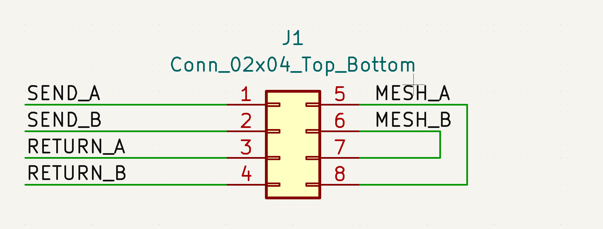

KiCAD Security Mesh Generator
=============================

.. image:: kicad-mesh-result-large.png
   :width: 800
   :alt: A screenshot of KiCAD showing a PCB security mesh generated by KiMesh.

This repository contains KiMesh, a KiCAD pcbnew plugin that generates security mesh traces on a KiCAD PCB.

Installation
------------

KiMesh has two parts: The pcbnew plugin that generates the traces, and the magic footprints that you use to tell the
plugin how many traces of which dimensions to generate where.

To install the plugin, copy the "kimesh" directory into your KiCAD installation's scripting plugin folder. Usually, this
is `~/.config/kicad/scripting/plugins/` for KiCAD stable installations or
`~/.config/kicad/[major version].99/scripting/plugins/` for nightly builds. On Windows, these paths can be found in your
user account's `AppData/Roaming` directory.

To install the footprint libraries, the easiest way is to download the library zip from the project's repo
`[link] <https://git.jaseg.de/kimesh.git/plain/mesh_footprints.tar.xz?h=main>`__, unpack it to your project folder, and
add the unpacked libraries as project-specific libraries through KiCad's library management thingy.

Usage
-----

To work, KiMesh requires four things:

1. An area free of other features such as footprints or traces where to generate the mesh.
2. One or more "graphic polygons" on a drawing layer that specify the area of the mesh.
3. A closed board outline on the `Edge.Cuts` layer.
4. One of the magic footprints from the KiMesh anchor library that defines the mesh's number of wires and their
   dimensions, and tells KiMesh where to start the mesh and in which direction to start it.

You can choose any layer for the outline polygons, such as the pre-defined `User.Eco1` or `User.X` layers, or you can
define your own. You just have to select that layer later in KiMesh's generator dialog. Note that KiMesh only processes
graphic polygons on that layer, and ignores other shapes such as lines, rectangles or circles. You can still use other
shapes, but you have to manually convert them to polygons before running KiMesh. To convert other shapes to
a polygon, select them, open the context menu with a right click, then choose the "Create from Selection 🞂 Create
Polygon from Selection" entry. For rectangles or circles, use the "Use Centerlines" option. For lines or arcs, use the
"Create bounding hull" option.

Place the magic anchor footprint on the outline of the mesh's shape polygons so that you have space to route out the
traces. The anchor footprint has an arrow on the `F.Fab` layer that indicates in which direction the mesh will be
generated.

I recommend adding the mesh to the schematic with one of KiCad's built-in `Connector_02xN_Top_Bottom` footprints. For a
mesh with k wires, choose a symbol with two rows of 2k pins each. For instance, for two mesh wires, choose
`Connector_02x04_Top_bottom`. Then assign one of the magic footprints to that symbol. To avoid DRC warnings, join the
two halves of the mesh on the output side of the footprint. That's the right side in default orientation, where the
higher-numbered pins are.

         KiCad's schematic editor.

Theory of operation
-------------------

I have published a post_ on my blog on the theory of operation behind KiMesh.

.. _post: https://blog.jaseg.de/posts/kicad-mesh-plugin/
